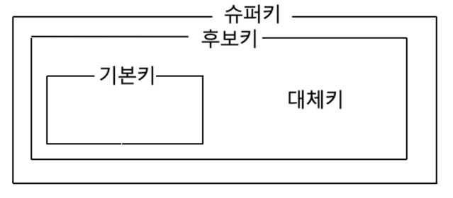

# Database

 

-----------------------

### DBMS 

    
 보기 

     

-----------------------

데이터베이스 관리 시스템으로 여러 사용자가 데이터베이스에 접근하여 사용할 수 있도록 해주는 소프트웨어

-----------------------

 

-----------------------

### Database를 사용하는 이유

    
 보기 

     

-----------------------

- 파일 시스템의 데이터 중복, 비일관성, 검색 등의 문제를 해결하기 위해서 사용한다.
- 파일 시스템이 운영체제마다 다를 수 있는데, 운영체제에 종속적인 파일 시스템을 이용하는 것은 프로그램의 확장성을 해치기 때문이다.

-----------------------

 

-----------------------

### Schema

    
 보기 

     

-----------------------

데이터베이스의 구조와 제약조건에 관한 전반적인 명세를 기술한 메타데이터 집합이다.

-----------------------

 

-----------------------

### Table

    
 보기 

     

-----------------------

- 행과 열로 이루어진 데이터 집합을 말한다.
- 행(Tuple or Record)
  - 테이블을 구성하는 데이터들 중 가로로 묶은 데이터 셋이다.
  - 일반적으로 한 행은 한 객체에 대한 정보를 갖는다.
  - 튜플 또는 레코드라고 부른다.
- 열(Attribute)
  - 테이블을 구성하는 데이터들 중 세로로 묶은 데이터 셋이다.
  - 속성이라고 부른다.

-----------------------

 

-----------------------

### Domain

    
 보기 

     

-----------------------

 데이터베이스 필드에 채워질 수 있는 값들의 집합이다.
> 예를 들어, 도메인이 1과 10 사이의 정수인데 11이 들어가거나 "고양이"가 들어갈 수 없다.

-----------------------

 

-----------------------

### View

    
 보기 

     

-----------------------

- 하나 이상의 테이블에서 유도된 것으로 메모리에 물리적으로 존재하지 않는 가상 테이블이다.
- 특정 사용자로부터 특정 속성을 숨기는 기능으로 뷰를 정의하여 그 뷰를 테이블처럼 사용한다.
- 인덱스를 가질 수 없고, 뷰의 정의를 변경할 수 없다.
- 기본키를 포함하고 정의할 경우에 삽입, 삭제, 갱신이 가능하다.

-----------------------

 

-----------------------

### Key

    
 보기 

     

-----------------------

- 검색, 정렬 시 튜플을 구분하는 기준이 되는 속성이다.
- 유일성 : 키로 튜플을 유일하게 식별할 수 있는 것.
- 최소성 : 튜플을 구분하는데 꼭 필요한 속성들로만 구성된 것.

**후보키**
- 테이블을 구성하는 속성 중에서 튜플을 유일하게 식별할 수 있는 속성들의 부분집합
    > 즉, 기본키로 사용할 수 있는 속성이다.
- 모든 테이블은 하나 이상의 후보키를 가진다.
- 유일성과 최소성을 만족한다.

**기본키**
- 후보키 중에서 선택한 PK
- 특정 튜플을 유일하게 식별 가능
- 중복값과 NULL이 불가능하다.
- 유일성과 최소성을 만족한다.

**대체키**
- 후보키가 두개 이상일 때, 기본키를 제외한 나머지 후보키들을 말한다.

**슈퍼키**
- 고유하게 식별하는 모든 후보키들을 조합하는 키
- 유일성은 만족하지만 최소성은 만족하지 않는다.

**외래키**
- 다른 테이블(릴레이션)의 속성을 참조하는 것으로 참조 관계를 표현하는데 사용하는 키이다.
- 테이블의 열 중 다른 테이블의 기본키를 참조하는 열이다.
- 테이블 간의 연결, 중복 방지, 무결성 유지를 위해 사용한다.

-----------------------

 

-----------------------

### Transaction

    
 보기 

     

-----------------------

- 데이터베이스의 상태를 변화시키는 하나의 논리적인 작업 단위이다.
- 논리적인 작업의 쿼리 개수와 관계 없이 논리적인 작업 셋 자체가 100% 적용되거나 아무것도 적용되지 않아야 함을 보장해야 한다.
  > Commit - 트랜잭션이 성공하여 트랜잭션 결과를 영구적으로 반영하는 연산
  > Rollback - 트랜잭션이 수행한 결과를 원래 상태로 복구시키는 연산 

-----------------------

 

-----------------------

### Transaction ACID

    
 보기 

     

-----------------------

- 원자성 - `Atomicity`
  > 트랜잭션을 구성하는 연산 자체가 모두 정상적으로 실행되거나 취소되어야 한다.
- 일관성 - `Consistency`
  > 트랜잭션이 실행을 성공적으로 완료하면 언제나 일관성이 있는 데이터베이스 상태로 유지한다.
- 고립성 - `Isolation`
  > 두 개 이상의 트랜잭션이 동시에 발생할 때, 서로의 연산에 영향을 주면 안된다.
- 영구성 - `Durability`
  > 커밋된 트랜잭션의 내용은 영구히 반영된다.

-----------------------

 

-----------------------

### Transaction 상태

    
 보기 

     

-----------------------
- 활동 - `Active` : 트랜잭션이 실행 중인 상태
- 장애 - `Fail` : 트랜잭션이 실행에 오류가 발생하여 중단한 상태
- 철회 - `Aborted` : 트랜잭션이 비정상적으로 종료되어 Rollback을 수행하는 상태
- 부분 완료 - `Partially Commit` : 트랜잭션이 마지막 연산까지 실행했지만, 커밋 연산이 실행되기 직전인 상태
- 완료 - `Committed` : 트랜잭션이 성공적으로 종료되어 커밋 연산을 수행한 후인 상태

-----------------------

 

-----------------------

### Transaction 격리 수준

    
 보기 

     

-----------------------

**Read Uncommitted**
  - 다른 트랜잭션에서 커밋되지 않은 내용에 접근이 가능하다.
    > Dirty Read, Non-Repeatable Read, Phantom Read 현상 발생
    > Dirty Read - 다른 트랜잭션에서 커밋되지 않은 데이터에 접근이 가능한 것.

**Read Committed**
  - 커밋된 내용만 접근이 가능하다.
  - 한 트랜잭션 내에서 검색 결과가 비일관적인 현상이 발생한다. 
    > Non-Repeatable Read, Phantom Read 현상 발생
    > Non-Repeatable Read - 한 트랜잭션 내에서 비일관적인 현상이 발생하는 것.

**Repeatable Read**
  - 커밋이 완료된 데이터만 읽을 수 있다.
  - 트랜잭션 범위 내에서 조회한 내용이 항상 동일함을 보장해야한다.
     > Phantom Read 현상 발생
     > Phantom Read - 일정 범위 행(레코드)을 두번 이상 읽을 때, 첫번째 쿼리에서 없던 유령 레코드가 나타나는 현상

**Serializable**
  - 한 트랜잭션에서 사용하는 데이터는 다른 트랜잭션이 접근 불가능하다.
  - 신형 트랜잭션이 읽은 데이터를 후행 트랜잭션이 관리하지 못할 뿐만 아니라 중간에 새로운 레코드를 삽입하는 것도 막아준다.
     > 데이터 안정성을 위배하는 어떤 것도 발생할 수 없을 정도록 높은 고립성을 가지기 때문에 동시성이 많이 떨어지고 성능이 안좋다.

-----------------------

 

-----------------------

### 

    
 보기 

     

-----------------------

-----------------------

 

-----------------------

### 

    
 보기 

     

-----------------------

-----------------------

 

-----------------------

### 

    
 보기 

     

-----------------------

-----------------------

 

-----------------------

### 

    
 보기 

     

-----------------------

-----------------------

 

-----------------------

### 

    
 보기 

     

-----------------------

-----------------------

 

-----------------------

### 

    
 보기 

     

-----------------------

-----------------------

[참조]
- https://velog.io/@backtony/%EB%A9%B4%EC%A0%91-%EC%8B%9C%EB%A6%AC%EC%A6%883-DB
- https://github.com/VSFe/Tech-Interview/blob/main/04-DATABASE.md
