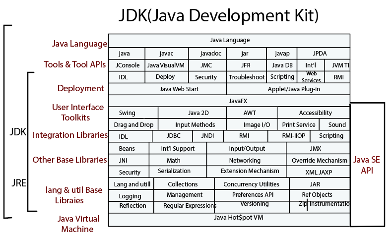
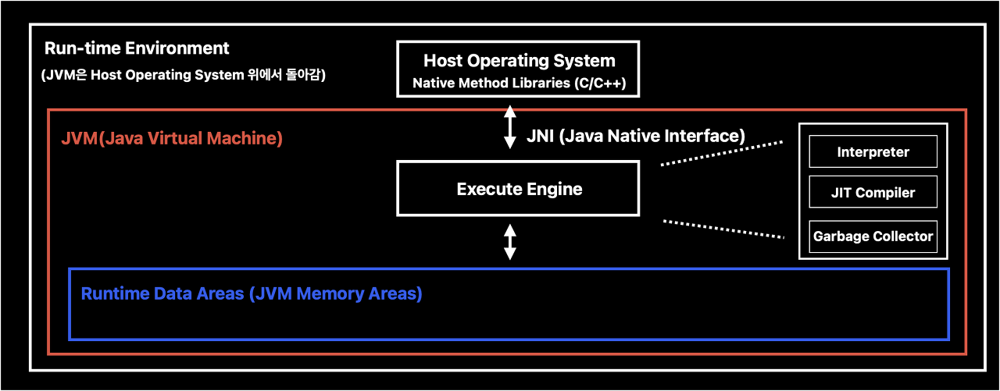

# JAVA

---

## JVM, JRE, JDK

### JVM
> **_JVM(Java Virtual Machine) = JIT Compiler + Java Interpreter + Garbage Collector :_**
> 
> 자바 가상 머신. Source Code(.java)가 Java Compiler(javac)를 거쳐서 Byte Code(.class)가 되면, 이 byte code를 host 운영체제
> 위에서 실행할 수 있도록 하는 환경이다. 즉, Java를 실행함에 있어서 JVM은 필수적이다.

**JVM의 특징**

* 스택 기반 가상머신: 인텔 x86 아키텍처, ARM 아키텍처와 같은 하드웨어가 레지스터 기반으로 동작하는 것과는 다르게 JVM은 스택 기반으로 동작한다.

* 심볼릭 레퍼런스: 기본 자료형(primitive data type)을 제외한 모든 타입(클래스, 인터페이스)을 명시적인 메모리 주소 기반의 레퍼런스가 아니라 심볼릭 레퍼런스를
통해 잠조한다. (primitive data type은 명시적인 메모리 주소 기반의 레퍼런스)

* 가비지 컬렉션: 클래스 인스턴스는 사용자 코드에 의해 명시적으로 생성되지만, Garbage Collection이 자동으로 없애준다.

* 네트워크 바이트 오더: 메모리에 바이트를 저장하는 순서인 리틀 엔디안, 빅 엔디안 사이에서 JVM 플랫폼 독립성을 유지하기 위하여 고정된 바이트
순서를 유지해야하므로, 네트워크 전송 시에 사용하는 바이트 오더인 네트워크 바이트 오더를 자바 클래스 파일에서 사용한다. (네트워크 바이트 오더는 낮은 주소에 데이터의 높은 바이트를 저장하는 빅 엔디안이다.)

### JRE
> **_JRE(Java Runtime Environment) = JVM + Library Classes :_**
> 
> Java 애플리케이션이 "실행"될 수 있는 최소한의 환경으로, JRE가 설치되어 있으면 애플리케이션을 실행하는 것에는 문제가 없다. 그러나, 개발을 위한 도구인 컴파일러나 디버거는 없다.
> JVM, 필수 라이브러리(rt.jar) 등이 있다. 이때, rt는 Runtime을 의미하는 것으로, String 클래스, System 클래스 등이 속한다.

### JDK
> **_JDK(Java Development Kit) = JRE + Development Tool :_**
> 
> Java 애플리케이션을 "개발"할 수 있는 도구 모음이다. 실행될 수 있는 최소한의 환경인 JRE와 개발을 위한 Java Compiler(javac), 역어셈블러(javap),  Debugger 등 도구가 있다.

## JVM 상세

Java 컴파일러가 실행되어 Java 소스코드가 바이트코드(.class)로 컴파일되고 이를 실행시키면 JVM의 클래스 로더가  JVM의 Memory area인 
Runtime Data Area에 바이트 코드인 클래스 파일을 올리면 이를 이용하여 JVM의 Execute Engine이 사용할 수 있게 된다.

이때 클래스 파일 모두가 바로 메모리에 올려지지 않는다. 자바는 동적으로 클래스를 읽어오므로, 프로그램이 실행 중인 런타임에서야 모든 코드가
JVM과 연결되는데, 이렇게 동적으로 클래스를 로딩해주는 역할을 하는 것이 바로 클래스 로더(class loader)이다. 클래스 로더는 클래스(.class) 파일을 묶어서 JVM이 Host Operating System으로부터 할당받은 메모리 영역인 Runtime Data Area로 적재한다.

이후 Execution engine은 클래스로더를 통해 JVM의 런타임 데이터 영역에 할당된 바이트 코드를 명령어 단위로 읽어와서 네이티브 코드(기계 코드, 바이너리 코드, 0과 1)로
바꿔서 실행한다. 실행 중인 애플리케이션의 각 스레드는 JVM Execution Engine의 개별 인스턴스다.

실행 엔진은 이미 다른 언어로 작성된 라이브러리가 있어 자바로 재작성하고 싶지 않거나, 자바가 시스템 디바이스에 접근하거나 플랫폼 특정적인 작업을 원하는 경우,
자바로 구현하기에는 느리고 C/C++를 사용하여 성능 향상을 원하는 경우에 Host 운영체제에 있는 C/C++로 작성된 Native Method Libraries를 사용한다.
이때 네이티브 라이브러리를 호출할 수 있도록 도와주는 인터페이스가 바로 JNI(Java Native Interface)다.

---

### Reference

https://jae-yoon.tistory.com/
