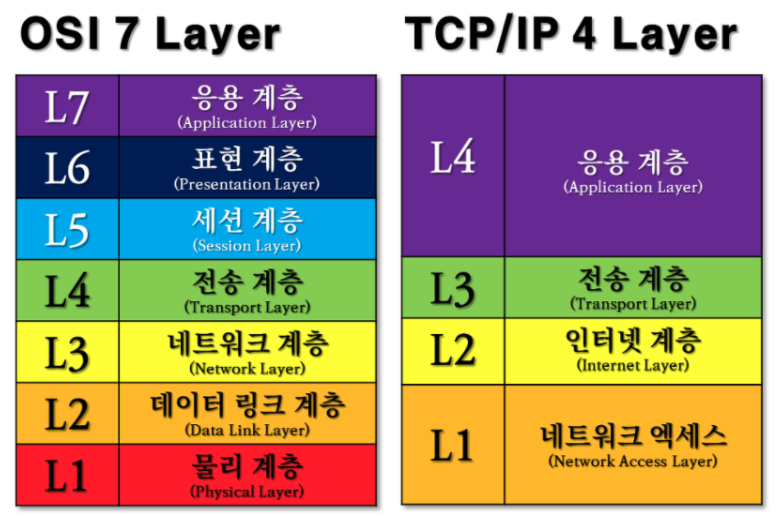
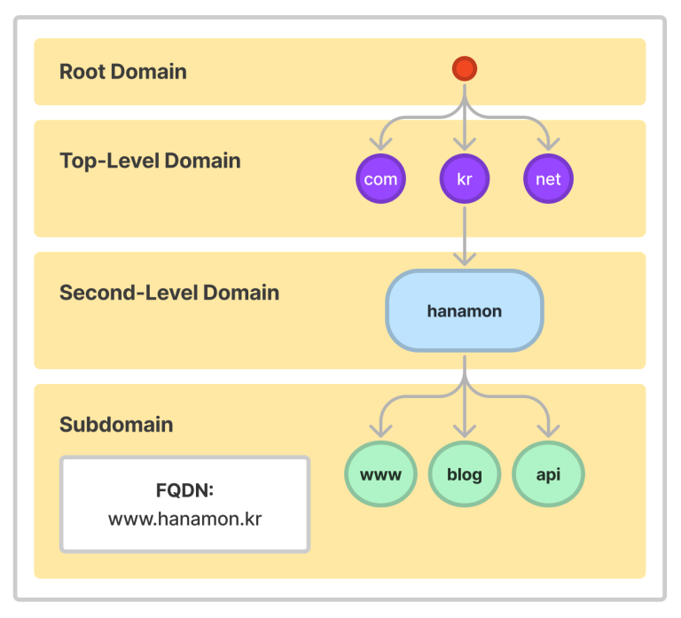
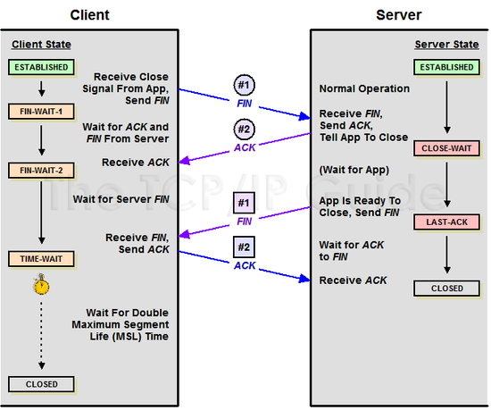

# Network

---

# OSI 7 계층

---

> **OSI 7**
> 
> **_국제표준화기구(ISO)에서 개발한 모델로서, 네트워크 프로토콜 디자인과 통신 과정을 7개의 계층으로 구분하여
> 만든 표준 규격이다._** 

- **_Application Layer (응용 계층)_**
  - **최종 목적지로 응용 프로그램과 연관하여 서비스를 수행하는 계층**
  - 사용자와 직접 접하는 유일한 계층.
  - EX) HTTP, DNS, FTP...

- **_Presentation Layer (표현 계층)_**
  - **데이터 압축, 변환이 이뤄지는 계층** 
  - 응용 계층으로부터 전달 받거나 전송하는 데이터의 인코딩 - 디코딩 및 암호화 등이 이루어지는 계층.
  - 코드 간의 번역을 담당하여 데이터의 형식상 차이를 다루는 부담을 응용 계층으로부터 덜어준다.
  - EX) JPEG, MPEG, AFP

- **_Session Layer (세션 계층)_**
  - **데이터가 통신하기 위한 논리적 연결을 담당하는 계층**
  - 통신 세션을 구성하는 계층으로, 포트 (Port) 번호를 기반으로 연결한다.
  - TCP/IP 세션을 만들고 없애는 역할
  - 통신하는 사용자들을 동기화하고 오류 복구 명령들을 일괄적으로 다룬다.
  - 네트워크 상 양쪽 연결을 관리하고 연결을 지속시켜주는 계층
  - _Session_ -> 클라이언트와 웹 서버 간 네트워크 연결이 지속적으로 유지되고 있는 상태

- **_Transport Layer (전송 계층)_**
  - **종단 간의 사용자들에게 신뢰성 있는 데이터를 전달하는 계층**
  - 패킷의 전송이 유효한지 확인하고, 전송에 실패된 패킷을 다시 보내는 것과 같은 신뢰성 있는 통신을 보장한다.
  - 흐름 제어: 송신측과 수신측 사이의 데이터 처리 속도 차이를 제어
  - 혼잡 제어: 네트워크 혼잡을 피하기 위해 데이터의 전송 속도 제어
  - 오류 제어: 오류 검출과 재전송

- **_Network Layer (네트워크 계층)_**
  - **IP를 지정하고 라우터로 경로를 선택해 네트워크를 통해 패킷을 전달하는 계층**
  - 전송되는 데이커는 패킷 단위로 분할하여 전송한 후 다시 합쳐진다.

- **_DataLink Layer (데이터 링크 계층)_**
  - **신뢰성 있는 전송을 보장하기 위한 계층**
  - 물리적인 네트워크 사이에 데이터 전송을 담당하는 계층
  - MAC(맥) 주소를 가지고 통신
  - 패킷을 프레임(Frame)으로 구성하여 물리 계층으로 전송
  - 묶여있는 호스트-노드 또는 노드-노드 사이에서의 신뢰성 관련 기능을 제공한다.

- **_Physical Layer (물리 계층)_**
  - **전기적, 물리적 세부 사항을 정의하는 계층**
  - 단지 데이터를 전달만 할 뿐, 전송받으려는 데이터가 무엇인지, 어떤 에러가 있는지는 전혀 신경 쓰지 않는다.
  - 상위 계층(데이터 링크)에서 전송된 데이터를 물리적인 전송 매체(허브, 라우터, 케이블 등)를 통해  다른 시스템에
    전기적 신호를 전송하는 역할

## 전송 계층

> **전송 계층과 데이터 링크 계층의 차이?**
> 
> 전송 계층은 논리적으로 1:1 연결된 송신, 수신 호스트 즉 종단간의 호스트에 관한 신뢰성 관련 기능을 제공하고,
> 데이터 링크 계층은 물리적으로ㅓ 1:1 연결된 호스트 사이의 전송 즉 직접 묶여있는 호스트-노드 또는 노드-노드 사이에서의 
> 신뢰성 관련 기능을 제공한다.

* **_TCP 패킷 추적 관리_**
  * 데이터는 패킷 단위로 쪼개져 같은 목적지로 전송된다.
  * 따라서 패킷에 각각 번호를 부여하여 패킷의 분실 확인 처리를 하기 위해 목적지에서 패킷을 재조립한다.

* **_흐름 제어_**
  * 송신측과 수신측 사이의 데이터 처리 차이를 제어하기 위한 기법으로 송신측의 데이터 처리 속도를 조절하여 수신자의 버퍼 오버플로우를 방지한다.
  * 슬라이딩 윈도우를 사용한다.
    * 송신 측에서 0,1,2,3,4,5,6을 보낼 수 있는 프레임을 가지고 있고 0,1을 전송했다면 슬라이딩 윈도우 구조는 2,3,4,5,6으로 변한다.
    * 수신측에서 ACK를 보내게 되면 송신측은 이전에 보낸 데이터 0,1을 수신측에서 정상적으로 받았음을 알게 되고 ACK 개수 만큼 프레임의 수를 
    오른쪽으로 확장한다.

* **_오류 제어_**
  * 프레임이 손상되었거나 손실되었을 경우, 재전송을 통해 오류를 복구한다.
  * 이때 2가지 방식이 있다.
    * Stop and Wait ARQ
      * 수신측에서 ACK 또는 NAK를 보낸다.
      * 수신측에서 받지 못하는 경우 NAK를 보내고 송신측은 해당 데이터를 재전송한다.
      * 만약 분실된 경우 일정한 간격의 시간을 두고 타임 아웃이 되면 송신측에서 재전송한다.
    * Go-Back-n ARQ
      * 손상되거나 분실된 경우 확인된 마지막 프레임 이후로 모든 프레임을 재전송한다.
      * 예를 들어 수신측에서 1, 3을 받게 되면 3을 버리고 2를 받지 못했다고 송신측에 보내고 송신측은 2부터 데이터를 다시 보낸다.
    * SR ARQ
      * Go-Back-n을 보완한 방법으로 손실된 프레임만 재전송한다.
      * 별도의 데이터 재정렬을 수행해야 하며, 별도의 버퍼를 필요로 한다.

* **_혼잡 제어_**
  * 네트워크 혼잡을 피하기 위해 송신측에서 보내는 데이터의 전송 속도를 제어하는 것
  * AIMD 방식
    * 처음 패킷 하나를 보내 문제가 없다면 Window Size를 1씩 증가시키는 방식
    * 문제가 발생하면 Window Size를 절반으로 줄인다.
    * 초기에 높은 대역폭을 사용하지 못하여 오랜 시간이 걸리고 네트워크가 혼잡해지는 상황을 미리 감지하지 못한다.
  * Slow Start 방식
    * 패킷을 2배씩 증가하여 데이터의 크기가 지수함수적으로 증가한다.
    * 전송되는 데이터의 크기가 임계값에 도달하면 혼잡 회피 단계로 넘어간다.
    * 혼잡 현상이 발생하면 Window size를 1로 줄인다.
    * 혼잡 현상이 발생했던 Window Size 절반 까지는 지수함수 꼴로 증가하고 이후부터는 1씩 증가한다.
  * Fast recovery 빠른 회복 방식
    * 혼잡 시 1로 줄이지 않고 절반으로 줄이고 선형 증가
  * 혼잡 회피
    * 임계값을 넘어가면 Window Size 1씩만 선형적으로 증가

---

# TCP/IP 4 계층

> **_TCP/IP란?_**
>
> TCP/IP는 IP(인터넷 프로토콜)와 TCP(전송 조절 프로토콜)의 묶음을 의미한다. 즉 두가지 프로토콜 방식을 조합하여 인터넷 통신하는 것을 TCP/IP 라고 부른다.
> 송신자가 수신자에게 IP를 사용하여 최대한 빠르게 패킷을 전송하면 TCP를 활용해 패킷을 정상적으로 수신 받는다.
> 이렇게 복수의 프로토콜 집합을 프로토콜 스택, 또는 프로토콜 스위트라고 부르며, 서로 다른 프로토콜 스택끼리는 통신할 수 없다.

* **IP (Internet Protocol)**
  * IP는 패킷 데이터들을 최대한 빨리 특정 목적지 주소로 보내는 프로토콜이다.
  * 빨리 보내는 것이 목적이기 때문에 패킷 전달 여부는 보증하지 않고 패킷을 보낸 순서와 받는 순서가 다를 수 있다.

* **TCP (Transmission Control Protocol)**
  * 패킷 통신은 작은 단위로 나누어 전송하기 때문에, 순서가 뒤섞이거나 내용이 유실될 수 있다는 단점이 있다.
  * 이러한 문제를 해결하기 위해 TCP 라는 프로토콜이 존재한다.
  * TCP는 패킷을 정상적으로 받을 수 있도록 하는 프로토콜이다.
  * 패킷 전달 여부를 보증하고, 패킷을 송신 순서대로 받게 해준다.
  * 즉, 목적지에 도착한 패킷들을 순서대로 정렬하고, 손상되거나 손실된 패킷이 있다면, 출발지에 재요청하는 방식으로 진행한다.

* 실제 사용되는 TCP/IP는 OSI 참조 모델을 기반으로 상업적이고 실무적으로 이용될 수 있도록 단순화된 모형이다
  * 네트워크 전송 시 데이터 표준을 정리한 것이 OSI 7계층, 이 이론을 실제 사용하는 인터넷 표준이 TCP/IP 4계층이다.

---

# DNS

> **_DNS(Domain Name System)란?_**
> 
> 웹사이트에 접속 할 때 우리는 외우기 어려운 IP 주소 대신 도메인 이름을 사용한다. 도메인 이름을 사용했을 때 입력한 도메인을 실제 네트워크상에서 사용하는 IP 주소로 바꾸고 해당 IP 주소로 접속하는 과정이 필요하다.
> 이러한 과정, 전체 시스템을 DNS(도메인 네임 시스템)라고 한다. 상위 기관에서 인증된 기관에게 도메인을 생성하거나 IP 주소로 변경할 수 있는 ‘권한’을 부여한다.
> DNS는 이처럼 상위 기관과 하위 기관과 같은 ‘계층 구조’를 가지는 분산 데이터베이스 구조를 가진다.

### DNS 구성 요소

1.도메인 네임 스페이스 (Domain Name Space): 규칙 또는 방법으로 도메인 이름 저장을 분산한다.

2.네임 서버(Name Server) = 권한 있는 DNS 서버: 해당 도메인 이름의 IP 주소를 찾는다.

3.리졸버(Resolver) = 권한 없는 DNS 서버: DNS 클라이언트 요청을 네임 서버로 전달하고 찾은 정보를 클라이언트에게 제공하는 기능을 수행한다.

리졸버는 한 단말에 구현할 수 없기 때문에 보통은 리졸버가 구현된 네임 서버의 IP 주소만을 파악한다. 이러한 네임 서버는 대표적으로
SK, KT, LG와 같은 ISP(통신사) DNS가 있다. 즉 Resolver = Recursive DNS Server = Local Server = Recursor.

### 도메인 네임 스페이스(Domain Name Space)

### 네임 서버(Name Server, DNS Server)

1. Root DNS 서버
* 국제 인터넷 주소 관리 기구(ICANN)에서는 루트 영역에 있는 13개 IP 주소 중 하나에 대한 서버를 운영하고 나머지 12개 IP 주소의 운영을 NASA, 메릴랜드 대학교, 그리고 루트 IP 주소 중 두 개를 운영하는 유일한 조직인 Verisign을 포함한 다양한 조직에 위임한다.
* TLD DNS 서버 IP 주소를 저장하고 안내하는 역할을 한다.

2. Top-Level Domain(TLD) DNS 서버
* 도메인 등록 기관이 관리하는 서버.
* SLD DNS 서버의 주소를 저장하고 안내하는 역할을 한다.
* 도메인 판매 업체의 DNS 설정이 변경되면 도메인 등록 기관으로 전달된다. 따라서 어떤 도메인이 어떤 판매 업체에서 구입됐는지 알 수 있다.

3. Second-Level Domain(SLD) DNS 서버(Authoritative DNS 서버)
* 실제 개인 도메인과 IP 주소의 관계가 기록(저장, 변경)되는 서버.
* 일반적으로 도메인/호스팅 업체의 네임서버를 말한다

4. 권한 없는 DNS 서버 (리졸버 서버, 리컬시브 서버, 리커서)
* DNS 서버는 도메인 네임 스페이스를 위한 권한 있는 DNS 서버와 권한이 없는 DNS 서버로 구분된다.
* 위 1,2,3은 권한 있는 DNS 서버이다.
* 네임 스페이스를 위한 권한 있는 DNS 서버는 IP 주소와 도메인 이름을 매핑한다.
* 네임 스페이스를 위한 권한 없는 DNS 서버는 질의를 통해 IP 주소를 알아내거나 캐시한다.

### DNS 동작 과정 전체

---

# TCP 3-way Handshake
>TCP 3 Way Handshake는 TCP/IP프로토콜을 이용해서 통신을 하는 응용프로그램이 데이터를 전송하기 전에
먼저 정확한 전송을 보장하기 위해 상대방 컴퓨터와 사전에 세션을 수립하는 과정을 의미한다.

* 양쪽 모두 데이터를 전송할 준비가 되었다는 것을 보장하고, 실제로 데이터 전달이 시작하기전에 다른 쪽이 준비되었다는 것을 알수 있도록 한다.

# TCP 4-way Handshake
> 4-Way handshake는 세션을 종료하기 위해 수행되는 절차다.

**_만약 "Server에서 FIN을 전송하기 전에 전송한 패킷이 Routing 지연이나 패킷 유실로 인한 재전송 등으로 인해 FIN패킷보다 늦게 도착하는 상황"이 발생한다면 어떻게 될까?_**

-> Client에서 세션을 종료시킨 후 뒤늦게 도착하는 패킷이 있다면 이 패킷은 Drop되고 데이터는 유실될 것이다.

이러한 현상에 대비하여 Client는 Server로부터 FIN을 수신하더라도 일정시간(Default = 2MSL(Maximum Segment Length))동안 세션을 남겨놓고
잉여 패킷을 기다린다. 이러한 과정을 "TIME_WAIT"라고 한다.

### 3 way와 4 way가 단계 차이가 나는 이유?
> Client가 데이터 전송을 마쳤다고 하더라도 Server는 아직 보낼 데이터가 남아있을 수 있기 때문에 일단 ACK만 먼저 보내고, 데이터를 모두 전송한 후에 자신도 FIN 메시지를 보내기 때문이다.

---

### Reference
https://backendcode.tistory.com/167#article-3--3--%EA%B3%84%EC%B8%B5-%EA%B5%AC%EC%A1%B0

https://velog.io/@jehjong/%EA%B0%9C%EB%B0%9C%EC%9E%90-%EC%9D%B8%ED%84%B0%EB%B7%B0-TCPIP-4%EA%B3%84%EC%B8%B5

https://velog.io/@backtony

https://hanamon.kr/dns%EB%9E%80-%EB%8F%84%EB%A9%94%EC%9D%B8-%EB%84%A4%EC%9E%84-%EC%8B%9C%EC%8A%A4%ED%85%9C-%EA%B0%9C%EB%85%90%EB%B6%80%ED%84%B0-%EC%9E%91%EB%8F%99-%EB%B0%A9%EC%8B%9D%EA%B9%8C%EC%A7%80/

https://bangu4.tistory.com/74