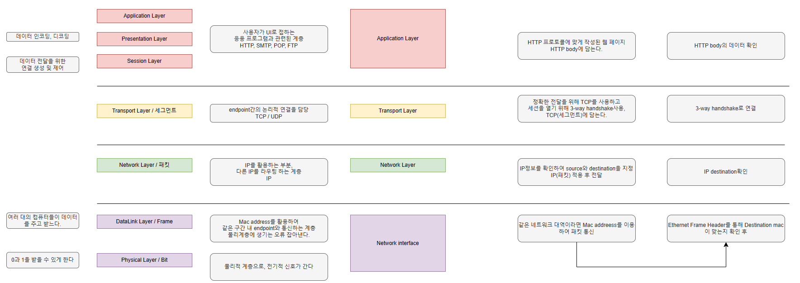
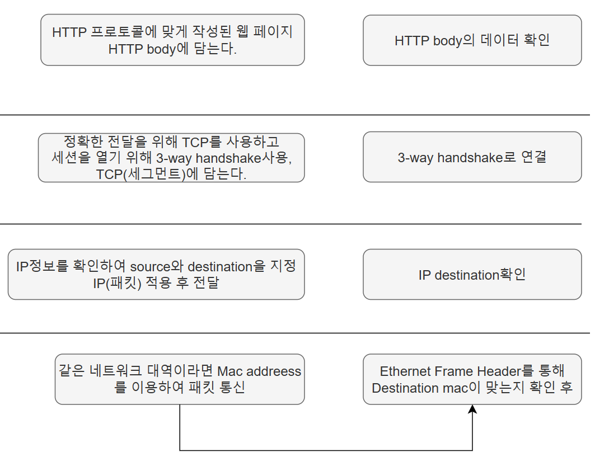
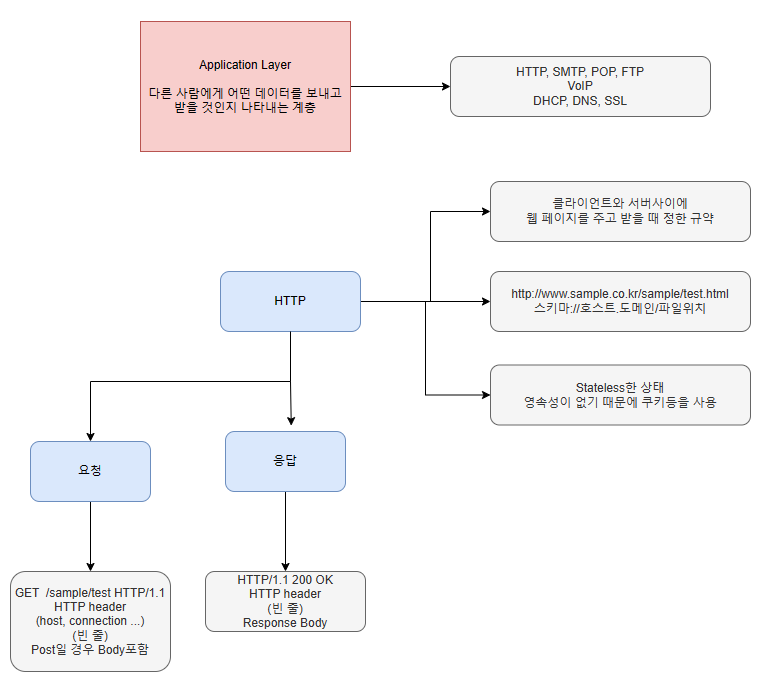
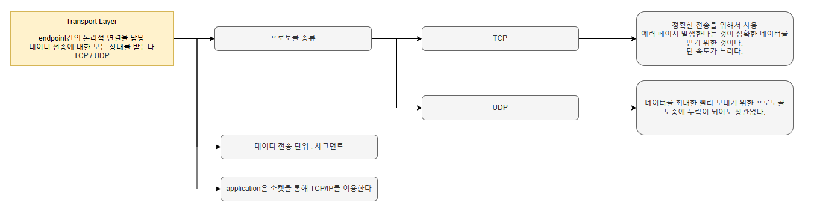
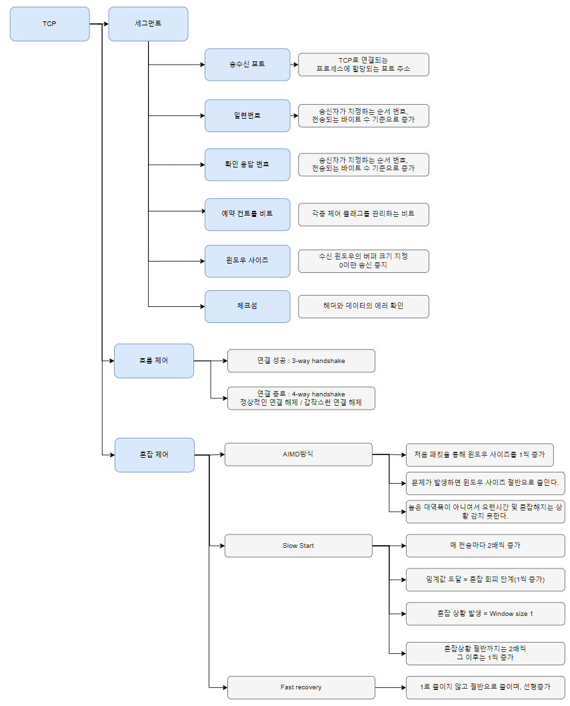
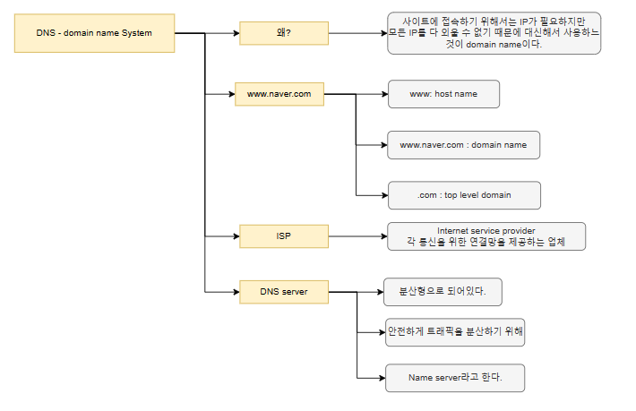
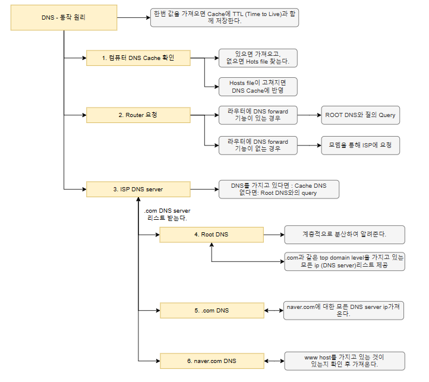
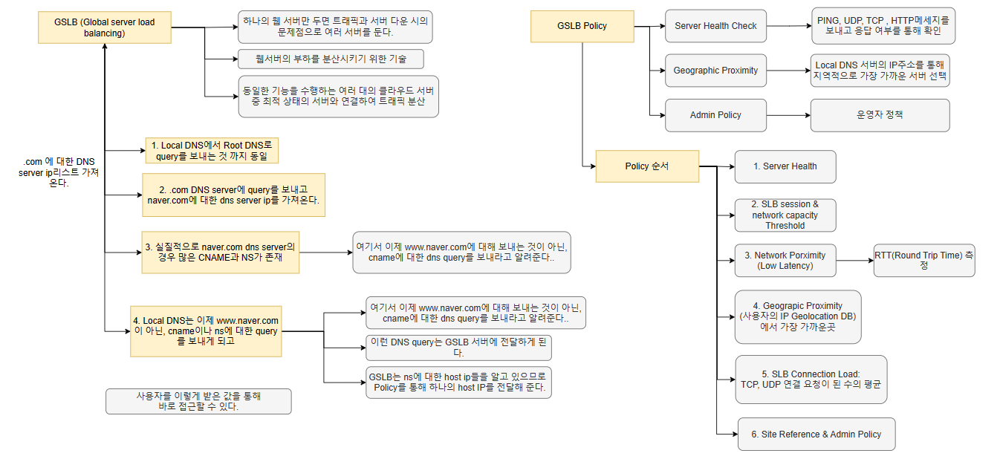
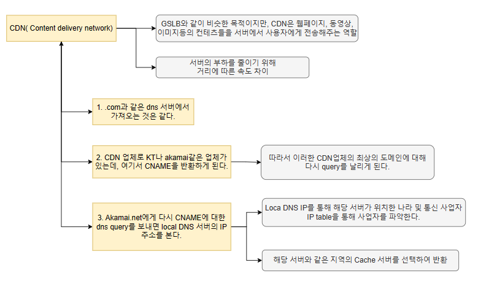
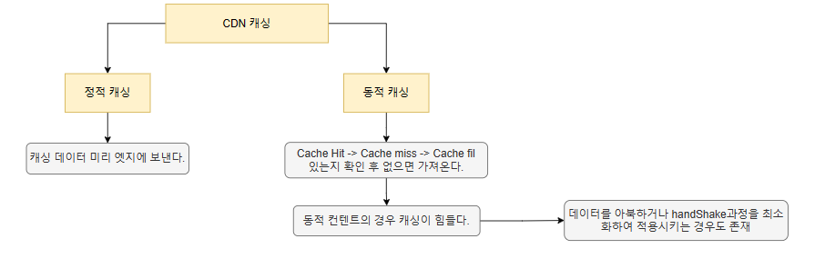

# OSI7 layer & TCP/IP4 layer

# Application Layer

# Transport Layer

### TCP

### UDP

# Network Layer

# DNS

## DNS 동작 (기본)

## DNS- GSLB

## DNS - CDN

### DNS - CDN Cache

### GSLB & CDN 차이

> 하나의 웹서버에 모든 것을 두면 트래픽이 몰리기 때문에 서버 다운 시의 문제점을 해결하기 위한 방법들로 GSLB와 CDN이 있다.

- GSLB는 서버를 분산 시키기 위한 기술

  - 동일한 기능을 수행하는 여러 대의 클라우드 서버 중 최적 상태의 서버와 연결하여 트래픽 분산

- CDN: 주로 이미지나 동영상, 웹페이지 등의 컨텐츠들을 서버에서 사용자들에게 전송해주는 역할
  - IP table에서 각 지역의 값을 가져와서 사용
  - 사실 근처 서버가 부하가 심하다면 근처의 서버에 요청을 보내서 가져온다.
