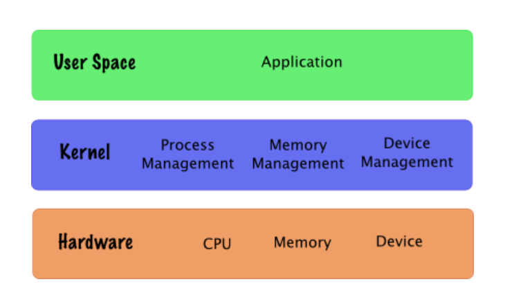
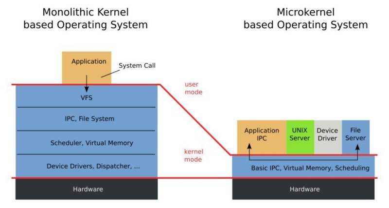
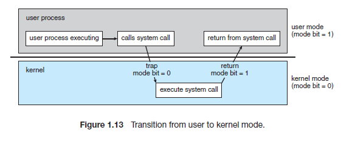
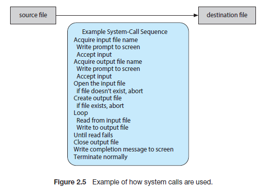

# Operating System

---

## Kernel

> **커널이란?**
> 
> 커널은 운영체제 중 항상 메모리에 올라가 있는 운영체제의 핵심 부분으로 하드웨어와 응용 프로그램 사이에서 인터페이스를 제공하는 역할을 하며 
> 컴퓨터 자원들을 관리하는 역할을 한다. 즉, 커널은 인터페이스로써 응용 프로그램 수행에 필요한 여러가지 서비스를 제공하고, 여러가지 하드웨어
> (CPU, 메모리) 등의 리소스를 관리하는 역할을 한다. 이러한 커널은 항상 컴퓨터 자원들을 바라만 보고 있기에 사용자와의 상호작용은 지원하지 
> 않는다. 따라서 사용자와의 직접전인 상호작용을 위해 프로그램을 제공하게 되는데, 대표적으로 쉘(Shell)이라는 명령어 해석기 등이 있다.

커널의 가장 큰 목표는 컴퓨터의 물리적(하드웨어) 자원과 추상화 자원을 관리 하는 것이다. 커널이 추상화하여 관리하는 물리적 자원들과 이를 추상화한
자원을 칭하는 용어로는 대표적으로 CPU - Task or Process, 메모리 - Page or Segment, 디스크 - File, 네트워크 - Socket 등이 있다.

이는 사용자가 물리적인 하드웨어에 접근하고 사용할 수 있도록 매개하기 위해서이다. 즉, 인터페이스로써 사용자가 컴퓨터만의 언어와 규칙으로 
하드웨어와 통신할 수 있도록 도와주는 역할을 한다.



커널 구성요소들이 존재하는 공간을 Kernel Space라고 한다. Kernel Space 위에서는 사용자로 여겨지는 User Space가 있으며 여기에는 
Task, Process들이 존재한다. 이 User Space와 Kernel Space 사이에는 보이지 않지만 ***System Call Interface*** 가 있다.
User Space의 Task 또는 Process들이 커널이 관리하는 자원에 접근해야할 필요가 있을때 ***System Call Interface*** 를 통해 Kernel Space의 
자원관리자에게 요청이 전달되는 방식이다. 그렇게 되면 커널은 사용자 요청에 맞는 하드웨어에게 명령을 전달하고 작업을 수행하는 역할을 한다.

> **커널은 _"사용자가 System Call을 통해 컴퓨터 자원을 사용할 수 있게 해주는 자원 관리자"_ 라고 할 수 있다.**

<br>

### 커널과 운영체제

커널과 운영체제에는 차이가 있다. 커널은 운영체제의 핵심 구성 요소이고, 이러한 커널에 사용자 애플리케이션과 유틸리티가 추가되면 운영체제가 된다.
즉 **커널 + 애플리케이션, 유틸리티 = 운영체제** 이다.

리눅스 자체는 File System Utilites, Windowing Systems, Graphical System, Text Editors, Compilers등과 같은 사용자 애플리케이션을
포함하지 않고 핵심기능만 포함하기때문에 커널이라고 할 수 있다.

이러한 리눅스를 기반으로 운영체제를 제공하는 회사들은 기본 리눅스 커널에 다양한 확장 애플리케이션을 추가하여 운영체제를 제공한다. EX) Red Hat,
Ubuntu, Kali

<br>

### 커널의 유형

> 커널은 크게 모놀리식 커널(Monolithic Kernel), 마이크로 커널(MicroKernel)로 나뉜다.



* **Monolithic Kernel**

모놀리식 커널은 우리가 개념적으로 알고 있는 커널로써 애플리케이션을 제외한 모든 System 서비스들, 예를 들어 VFS(Virtual File System),
IPC(InterProcess Communication), File System등 을 커널이 직접 처리하는 방식이다. 각 서비스들은 커널 내부의 여러 계층에서 관리된다.
모놀리식 커널은 사용자가 운영체제 서비스들을 ***System Call*** 을 통해 사용할 수 있게 해준다.

모놀리식 커널은 커널이 많은 것을 관리하기 때문에 커널의 크기가 크고, 하나의 오류가 전체 시스템에 영향을 끼칠 수 있다는 단점이 있다.
그러나 커널 내부에서 서비스들이 서로 시스템 자원을 공유하여 효율적으로 관리할 수 있고, 내부 서비스를 직접 커널이 수행하기 때문에 빠른 처리속도를 가지는 장점이 있다. 초기 모놀리식 커널은 단일
모듈이었기 때문에 내부 서비스의 추가, 수정이 있을 때 커널 전체를 다시 컴파일 및 로딩이 필요했다. 하지만 최신 모놀리식 커널은 여러개의 모듈로
구성되어 있어 이러한 단점이 보완되었다.

대표적인 Monolithic Kernel은 Unix, Embedded Linux 등이 있다.

<br>

* **Micro Kernel**

마이크로 커널은 기존의 모놀리식 커널에서 핵심 서비스 (Process Management, Memory Management, Network Management 등)만을 남겨 두고
나머지는 제외하여 가볍게 만든 커널이다. 기존의 모놀리식 커널이 가지고 있던 시스템 서비스 (VFS, IPC 등)들은 커널위의 서버의 형태로 존재한다.

마이크로 커널은 최소화하고 핵심적인 서비스들만을 모아놓고 서버를 추가하는 방식의 구조를 가지기 때문에 프로세스간 통신을 통해 대부분의 서비스가
수행된다. 따라서 메시지 전송에 따른 컨텍스트 스위칭이 많이 발생하고, 시스템 복잡도가 증가될수록 시스템 부하, 오버헤드가 증가하는 단점이 있다.
그러나 서버를 추가하는 방식으로 커널을 변경하지 않고 기능을 추가, 수정할 수 있으며 하나의 서비스의 문제로 인해 커널 전체가 panic되지 않는다.

대표적인 Micro Kernel은 MacOS, Windows NT 등이 있다.

---

## System Call

> System Call은 운영체제의 커널이 제공하는 서비스에 대해, 응용 프로그램의 요청에 따라 커널에 접근하기 위한 인터페이스이다. 보통 C나 C++과
> 같은 고급 언어로 작성된 프로그램들은 직접 시스템 콜을 사용할 수 없기 때문에 고급 API를 통해 시스템 콜에 접근하는 방법이다.
> **시스템 콜 또한 인터럽트의 일종이다.**

### System call이 필요한 이유

* 우리가 일반적으로 사용하는 프로그램은 '응용 프로그램'이다. 유저 레벨의 프로그램은 유저 레벨의 함수들 만으로는 많은 기능을 구현하기 힘들기
때문에 커널의 도움이 반드시 필요하다. 이러한 작업은 응용 프로그램으로 대표되는 유저 프로세스(User Process)에서의 유저 모드에서는 수행할 수 없다.
반드시 Kernel과 관련된 것은 커널모드로 전환하고 (Dual Mode) 해당 작업을 수행할 권한이 생긴다. 커널 모드를 통한 이러한 작업은 반드시 _**시스템 콜**_ 을 
통해 수행하도록 설계되어 있다. 

 [Dual Mode]

권한이 필요한 이유는 해커가 피해를 입히기 위해 악의적으로 시스템 콜을 사용하거나 초보 사용자의 하드웨어 명령어로 인해 시스템 전체가 망가질 수
있기 때문이다. 따라서 이러한 명령어들은 특별하게 커널 모드에서만 실행할 수 있도록 설계되어 있으며 만약 유저 모드에서 시스템 콜을 호출할 경우에는
운영체제에서 불법적인 접근이라 여기고 trap을 발생시킨다.

### System Call 예시

```text
cp in.txt out.txt
```

위는 리눅스 터미널에서 `in.txt`의 파일 내용을 복사하여 `out.txt`를 만든는 명령어다. 이때, 순차적으로 여러 시스템 콜이 호출된다.

일반적으로 마우스 또는 키보드를 통해 사용자로부터 입력을 받으면 I/O 시스템 콜을 사용한다. 이때는 `0x80` 인터럽트가 발생한다. 
위와 같은 문장을 입력 받아서 `cp`프로그램을 먼저 실행 시키면 먼저 `in.txt` 파일이 현재 디렉토리에서 접근할 수 있는 파일인지 검사하기 위해 시스템 콜을 호출한다. 만약 파일이 존재하지 않거나
접근할 수 없다면 에러를 발생시켜야 하고, 프로그램을 종료하는데 이때도 시스템 콜이 사용된다. 파일이 존재하면 복사한 파일을 저장하기 위해 `output.txt`
파일명이 있는지 검사한다. 그리고 파일 명이 존재한다면, 덮어 씌울지, 이어서 붙일지 User에게 물어볼 수 있다. 만약 겹치지 않는다면 파일을 저장하기
위해서도 시스템 콜을 사용한다.

텍스트를 복사하는 간단한 프로그램임에도 불구하고, 상당히 많은 시스템 콜이 발생한다는 것을 알 수 있다.



이러한 시스템콜을 직접접으로 사용하기 보다는 미리 만들어진 API를 가져와 사용한다. API는 OS에 특정되며 시스템 콜도 OS에 따라 구분된다. 윈도우에는
Win32 API, Win64 API가 있고 Unix 기반 OS에는 POSIX API가 있고, JVM에는 JAVA API가 있다. 이렇게 API를 사용함으로서 사용자들에게 편의를
제공할 수 있다.

이러한 함수의 수는 정해져 있으며 각각의 함수에는 숫자가 할당되어 있어 더 쉽게 라이브러리를 찾아갈 수 있게 한다. 이 숫자들로 테이블을 구성해서
테이블의 인덱스로 만들어 해당되는 시스템 콜 인터페이스를 더 쉽게 찾을 수 있게 OS 내부에서 관리한다.

예를 들어 유저가 파일을 오픈할 때 오픈 시스템을 부를 때까지 CPU는 유저 모드로 실행하고 파일을 오픈하는 함수를 실행하면 커널모드로 바뀌게 된다.
이후 시스템 콜이 있는 메모리 주소를 찾기 위해 시스템 콜 테이블을 찾아 인덱스를 통해 주소값을 찾고 해당 주소를 통해 시스템 콜을 실행한다. 이후
리턴과 함께 User Mode로 돌아가 유저 프로세스가 다시 실행된다.

시스템콜의 종류는 크게 다섯 가지의 중요한 범주로 나눌 수 있다. 프로세스 제어, 파일 조작, 장치 관리, 소켓 관련, 통신 관련이다.

### Dual Mode

> 사용자와 운영체제는 시스템 자원을 공유하기 때문에 자원을 보호하기 위해서 사용자에게 제한을 걸어야 한다. 이때 보호 장치가 바로 이중 동작 모드 (Dual-mode operation)이다.


Dual Mode는 사용자 모드와 커널 모드로 구성되어 있다. 이들은 각각 사용자를 위한 동작과 운영체제를 위한 동작을 담당한다. 이중 동작 모드를 통해서 사용자 모드에서는 불법적인 명령을 하지 못하게 한다.
위의 이미치처럼 사용자가 사용하는 응용 프로그램은 사용자 모드에서 작동한다. 그러다가 해당 프로그램이 운영체제에게 시스템 사용을 요청하게 되면
커널 모드로 바꾸어서 요청된 시스템을 실행한 뒤에 다시 사용자 모드로 전환한다. 즉 인터럽트(Interrupt)나 시스템 콜(System call)을 호출하게 되면 커널 모드로 전환된다.

이 커널 모드와 사용자 모드를 구분 짓기 위해서 Mode bit라고 하는 하나의 비트가 컴퓨터의 하드웨어에 추가 되어있다. 이 비트는 커널 모드(0) 또는 사용자 모드(1)를 나타낸다.
이 비트의 사용으로 운영체제를 위해 실행되는 작업과 사용자를 위해 실행되는 작업을 구분할 수 있다.

시스템 부트 시 하드웨어는 커널 모드에서 시작한다. 이어서 운영체제가 적재되고, 사용자 모드에서 사용자 프로세스가 시작된다. 트랩이나 인터럽트가
발생할 때마다 하드웨어는 사용자 모드에서 커널 모드로 전환한다 (즉, 모드 비트를 0으로 변경한다). 그러므로 운영체제가 컴퓨터의 제어를 얻을 때마다 항상 커널 모드에 있게 된다.
시스템은 사용자 프로그램으로 제어를 넘기기 전에 항상 사용자 모드(모드 비트 1로 설정)로 전환한다.
---

### Reference

https://minkwon4.tistory.com/295

https://fjvbn2003.tistory.com/306

https://unagi-zoso.tistory.com/209

https://neos518.tistory.com/115