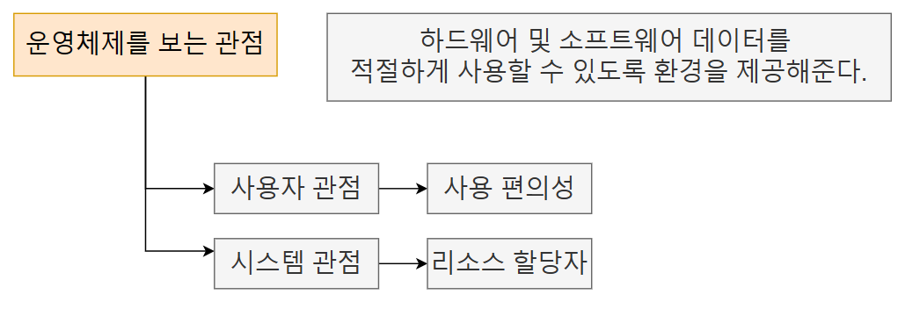
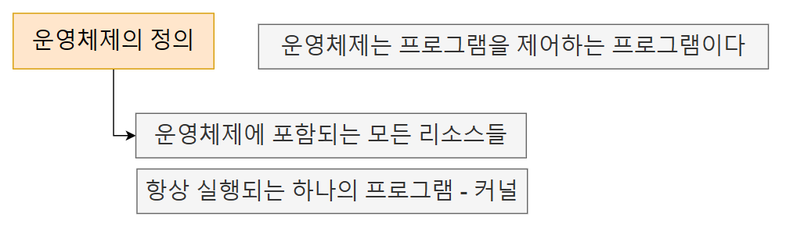
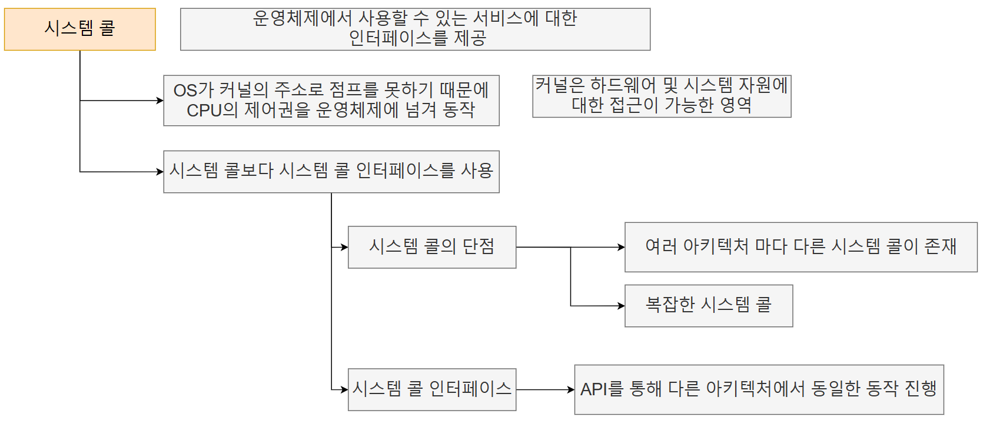
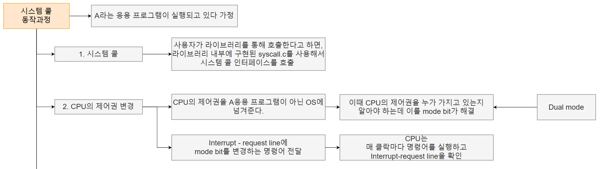
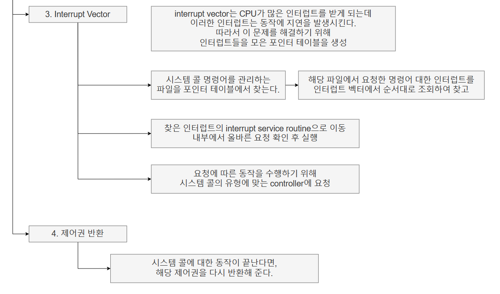
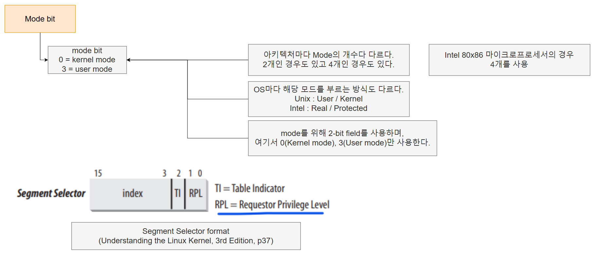
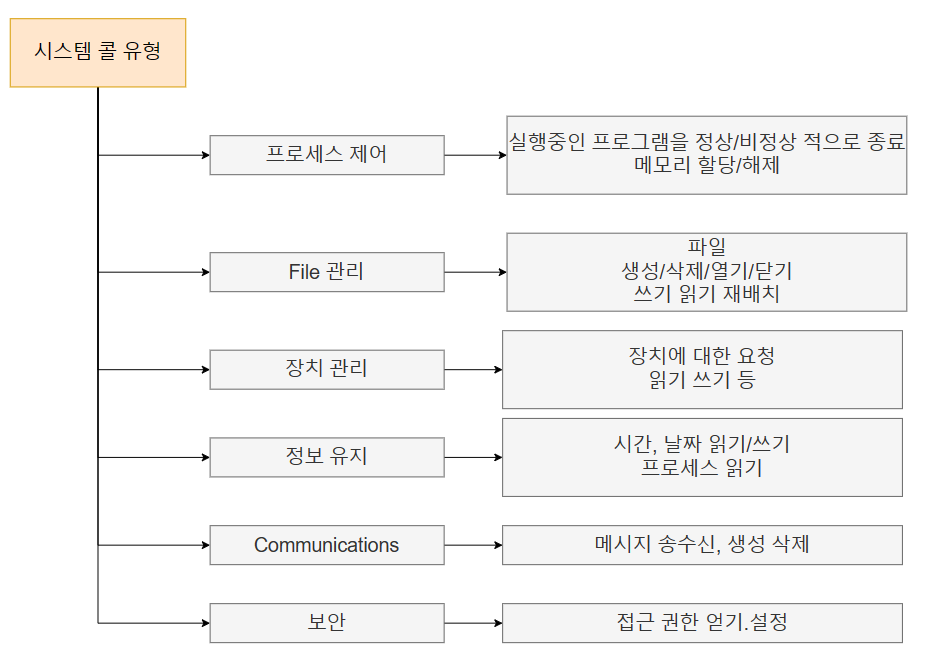
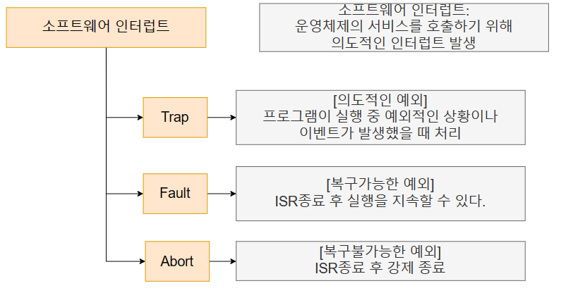

# 운영체제

## 운영체제를 보는 관점

## 운영체제란?

# 시스템 콜

## 시스템 콜이란

- 우리가 사용하는 `printf`나 `scanf`는 하나의 API로 볼 수 있다

## 시스템 콜 동작

## 시스템 콜 Mode bit

- 참고서적 : [Understanding Linux Kernel](https://www.oreilly.com/library/view/understanding-the-linux/0596005652/)
- 해당 내용은
  - chapter1: An Overview Of Unix Kernels (p19)
  - chapter2: Segmentation in Hardware (p36~p37)

## 시스템 콜 타입

## 소프트웨어 인터럽트

